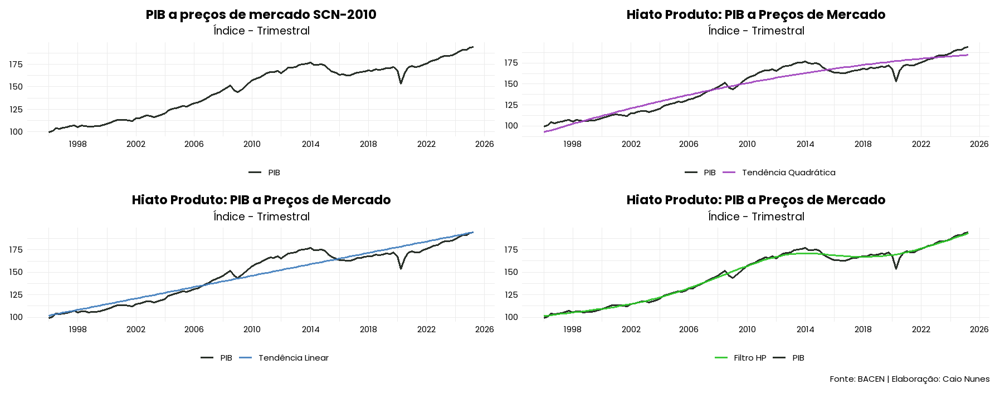

# Estimando o Hiato do Produto utilizando R

Autor: Caio Nunes     

Instituição: FECAP — Ciências Econômicas

Período analisado: 1996–2025

Fonte dos dados: Banco Central do Brasil (SGS = 22109)


## 📊 Objetivo
Este projeto tem como objetivo estimar o hiato do produto para a economia brasileira, utilizando diferentes métodos de cálculo do PIB potencial.
O hiato do produto mede a diferença entre o PIB Efetivo e o PIB Potencial em uma economia, indicando momentos com pressões inflacionárias e deflacionárias.

Os modelos explorados incluem:
 - Tendência Linear
 - Tendência Quadrática
 - Filtro HP


**Variáveis**:
PIB a preços de mercado SCN-2010 dessazonalizados (SGS = 22109 | BACEN)

## Passo a Passo da Análise

### 1. Extração de Dados do SGS - Sistema Gerenciador de Séries Temporais do Banco Central
Extração de dados do PIB a preços de mercado SCN - (SGS = 22109) entre o período de 1996 até 2025. 
```r
base <- get_series(
  code = c('pib' = 22109), 
  start_date = '1996-01-01',
  end_date = Sys.Date()
)
```

### 2. Preparação dos Dados
```r
dados <- base %>% 
  select(data = date, pib) %>% 
  mutate(data = yearmonth(data)) %>%
  as_tsibble(index = data)
```

### 3. Visualização Gráfica da Varíavel
Gráfico do PIB dessazonalizado:
```r
ggplot(data = dados, aes(x = data)) +
  geom_line(aes(y = pib, color = 'PIB'),
            alpha = 0.9, 
            linewidth = 1) +
  labs(title = 'PIB a preços de mercado SCN-2010', 
       subtitle = 'Índice - Trimestral', 
       x = NULL, 
       y = NULL) +
  theme_minimal() +
  scale_x_yearmonth(date_breaks = '4 years', 
                    date_labels = '%Y') +
  scale_color_manual(name = '',
                     values = c('PIB' = '#121A12')) +
  theme(legend.position = 'bottom',
        legend.text = element_text(family = 'poppins', color = 'black', 
                                   size = 11),
        plot.title = element_text(face = 'bold', family = 'poppins', 
                                  color = 'black', size = 17, hjust = 0.5),
        plot.subtitle = element_text(family = 'poppins', color = 'black', 
                                     size = 14, , hjust = 0.5),
        axis.text = element_text(family = 'poppins', color = 'black', 
                                 size = 11))
```

### 3. Estimação do PIB Potencial
Estimando o PIB Potencial por Tendência Linear:
```r
modelo <- lm(pib ~ data, data = dados)
summary(modelo)
trend_linear <- fitted.values(modelo)
```

Visualização gráfica do Hiato do Produto
```r
ggplot(data = dados, aes(x = data)) +
  geom_line(aes(y = pib, color = 'PIB'),
            alpha = 0.9, 
            linewidth = 1) +
  labs(title = 'PIB a preços de mercado SCN-2010', 
       subtitle = 'Índice - Trimestral', 
       x = NULL, 
       y = NULL) +
  theme_minimal() +
  scale_x_yearmonth(date_breaks = '4 years', 
                    date_labels = '%Y') +
  scale_color_manual(name = '',
                     values = c('PIB' = '#121A12')) +
  theme(legend.position = 'bottom',
        legend.text = element_text(family = 'poppins', color = 'black', 
                                   size = 11),
        plot.title = element_text(face = 'bold', family = 'poppins', 
                                  color = 'black', size = 17, hjust = 0.5),
        plot.subtitle = element_text(family = 'poppins', color = 'black', 
                                     size = 14, , hjust = 0.5),
        axis.text = element_text(family = 'poppins', color = 'black', 
                                 size = 11))
```


Estimando o PIB Potencial por Tendência Quadrática:
```r
modelo_quad <- lm(pib ~ poly(data, 2, raw = TRUE), data = dados)
summary(modelo_quad)
trend_quad <- fitted.values(modelo_quad)
```

Visualização gráfica do Hiato do Produto
```r
ggplot(data = dados, aes(x = data)) +
  geom_line(aes(y = pib, color = 'PIB'), 
            alpha = 0.9, 
            linewidth = 1) +
  geom_line(aes(y = trend_quad, color = 'Tendência Quadrática'), 
            alpha = 0.9, 
            linewidth = 1) +
  labs(title = 'Hiato Produto: PIB a Preços de Mercado', 
       subtitle = 'Índice - Trimestral', 
       x = NULL, 
       y = NULL) +
  theme_minimal() +
  scale_x_yearmonth(date_breaks = '4 years', 
                    date_labels = '%Y') +
  scale_color_manual(name = '', 
                     values = c('PIB' = '#121A12', 
                                'Tendência Quadrática' = '#9E40BD')) +
  theme(legend.position = 'bottom',
        legend.text = element_text(family = 'poppins', color = 'black', 
                                   size = 11),
        plot.title = element_text(face = 'bold', family = 'poppins', 
                                  color = 'black', size = 17, hjust = 0.5),
        plot.subtitle = element_text(family = 'poppins', color = 'black', 
                                     size = 14, , hjust = 0.5),
        axis.text = element_text(family = 'poppins', color = 'black', 
                                 size = 11))
```

Estimando o PIB Potencial pelo Filtro HP:
```r
hp <- hpfilter(dados$pib, freq = 1600)
trend_hp <- hp$trend
```
Estimar o modelo com mFilter (lambda = 1600)


Visualização gráfica do hiato com Filtro HP
```r
ggplot(data = dados, aes(x = data)) +
  geom_line(aes(y = pib, color = 'PIB'),
            alpha = 0.9, 
            linewidth = 1) +
  geom_line(aes(y = trend_hp, color = 'Filtro HP'),
            alpha = 0.9, 
            linewidth = 1) +
  labs(title = 'Hiato Produto: PIB a Preços de Mercado', 
       subtitle = 'Índice - Trimestral', 
       x = NULL, 
       y = NULL, 
       caption = 'Fonte: BACEN | Elaboração: Caio Nunes') +
  theme_minimal() +
  scale_x_yearmonth(date_breaks = '4 years', 
                    date_labels = '%Y') +
  scale_color_manual(name = '', 
                     values = c('PIB' = '#121A12', 
                                'Filtro HP' = '#28C423')) +
  theme(legend.position = 'bottom',
        legend.text = element_text(family = 'poppins', color = 'black', 
                                   size = 11),
        plot.title = element_text(face = 'bold', family = 'poppins', 
                                  color = 'black', size = 17, hjust = 0.5),
        plot.subtitle = element_text(family = 'poppins', color = 'black', 
                                     size = 14, , hjust = 0.5),
        plot.caption = element_text(family = 'poppins', color = 'black', 
                                    size = 11),
        axis.text = element_text(family = 'poppins', color = 'black', 
                                 size = 11))
```

